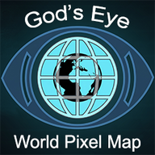
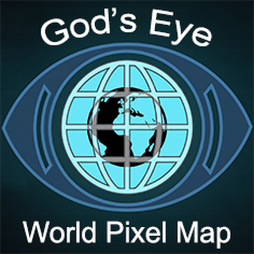

<div align="center">

# 🌐 Android God's Eye View
### By **WorldPixelMap**

<p align="center">
  
</p>

### A real-time geospatial intelligence console for planet Earth.

Photorealistic 3D globe, live aircraft, global maritime vessels, orbital satellites, seismic monitors, wildfire sensors, and public photographic CCTV feeds. Powered by a hands-free realtime AI agent. Available for modern web browsers and Android devices.
### "Special Thanks to @bilawalsidhu"

*No place left behind.*
Try other Apps: *https://worldpixelmap.in/apps_suite/*

[](LICENSE)
[](Android/)
[](https://cesium.com/)
[](scripts/run-unit-tests.mjs)

---

**[⚡ Quick Start](#-quick-start) · [📱 Android App](#-android-app) · [🎛️ Features](#️-key-features) · [🎙️ Voice Agent](#️-voice-agent) · [🛰️ Live Layers](#️-live-layers--data-stack) · [🔑 API Setup](#-api-keys--configuration) · [📜 License](#-license--attribution)**

</div>

---

## 🌍 Overview

**God's Eye View** fuses disparate real-time open signals into a single unified 3D operational picture. From transponder state vectors in the upper atmosphere to AIS vessel beacons crossing oceans, orbital satellite ephemerides, active wildfire perimeters, and live municipal street cameras — the entire planet is modeled in high-fidelity 3D with zero lag.

> Built with **CesiumJS**, **Google Photorealistic 3D Tiles**, and **OpenAI Realtime Voice**, God's Eye View delivers the visual language of an advanced intelligence operations center.

---

## 🎛️ Key Features

- **🌐 Photorealistic 3D Globe:** High-resolution 3D photogrammetry and terrain meshes rendered via Google 3D Tiles and CesiumJS.
- **✈️ Live Flight Tracking & Cockpit Mode:** Track thousands of commercial and military aircraft in real-time. Jump into the cockpit of any tracked flight with real-world orientation and terrain-following cameras.
- **🚢 Global Marine Navigation (AIS):** Track commercial shipping lanes, tankers, cargo vessels, and tugs worldwide with live course projection.
- **🛰️ Orbital Satellites & Space Missions:** Propagate real-time SGP4 orbits for the ISS, Starlink constellations, and weather satellites with orbital footprint projections and launch schedules.
- **📹 Live Photographic CCTV Engine:** Connects to real-world municipal camera networks across London (TfL JamCams), San Francisco & Bay Area (Caltrans D4), and Austin Mobility with estimated camera viewsheds.
- **🚗 Speed-Calibrated Traffic Simulation:** Realistic street-level traffic vector flow integrated with OpenStreetMap geometry.
- **🎨 Multi-Sensor Optics (GLSL Shaders):** Cycle through Night Vision (NVG), Forward Looking Infrared (FLIR Ironbow), CRT, Noir, and Snow sensor filters in real time.
- **🎖️ Tactical Military HUD:** Clean, non-colliding military HUD displaying MGRS coordinates, geodetic lat/lon, satellite identification, NIIRS scale, and AI scene summaries.
- **🎙️ Realtime AI Voice Co-Pilot:** Natural spoken interaction to fly camera routes, query visible objects, inspect telemetry, measure distances, and manage layers hands-free.

---

## ⚡ Quick Start (Web Application)

### Prerequisites
- **Node.js** 24.14.x or 26.x
- **npm** 10+

### Installation & Run

1. **Clone the repository:**
   ```bash
   git clone https://github.com/WorldPixelMap/android-gods-eye-view.git
   cd gods-eye-view
   ```

2. **Configure environment:**
   ```bash
   cp .env.example .env
   ```
   *Edit `.env` to configure your API keys (see [API Setup](#-api-keys--configuration)).*

3. **Install dependencies and start development server:**
   ```bash
   npm install
   npm run dev -- --host localhost --port 4173
   ```

4. **Launch:**
   Open **`http://localhost:4173`** in your browser.

---

## 📱 Android App

God's Eye View includes a native Android application engineered for landscape performance, WebView hardware acceleration, and integrated native camera proxying.

<p align="center">
  
</p>

### Building the Android APK

1. **Build & Sync Web Assets:**
   ```bash
   node Android/scripts/build-apk-assets.mjs
   ```

2. **Assemble Release APK:**
   ```bash
   cd Android
   ./gradlew assembleRelease
   ```
   *The signed APK will be output to `Android/app/build/outputs/apk/release/app-release.apk`.*

3. **Install on Connected Device via ADB:**
   ```bash
   adb install -r Android/app/build/outputs/apk/release/app-release.apk
   adb shell am start -n com.worldpixelmap.gev/.MainActivity
   ```

---

## 🎙️ Voice Agent

The integrated voice agent is powered by OpenAI's Realtime WebSocket protocol, providing sub-second latency voice commands and spatial understanding:

- **Navigation:** *"Take me to Tokyo."*, *"Orbit around downtown Austin."*, *"Fly the route from LAX to the coast."*
- **Intelligence Analysis:** *"What is the nearest airborne aircraft?"*, *"Which ships are approaching San Francisco Bay?"*, *"Show active fires in California."*
- **Whiteboard Annotations:** *"Outline the boundary of Central Park."*, *"Measure the distance from London Bridge to Heathrow Airport."*
- **Tactical Controls:** *"Switch to Night Vision."*, *"Turn on live satellite orbits."*, *"Enter the cockpit of the selected plane."*

---

## 🛰️ Live Layers & Data Stack

| Layer | Source / Provider | Auth | Description |
|---|---|---|---|
| 🗺️ **3D Photorealistic Mesh** | Google Maps 3D Tiles | 🔴 API Key | Global high-density 3D photogrammetric cities & terrain. |
| ✈️ **Live Flights (ADS-B)** | OpenSky Network / adsb.lol | 🟢 100% Free | Global aircraft telemetry, speed, altitude, and heading. |
| 🚢 **Live Vessels (AIS)** | AISStream.io | 🟡 Free API Key | Global maritime vessel positions, ship types, and destinations. |
| 🛰️ **Satellites (TLE)** | CelesTrak / Space-Track | 🟢 100% Free | SGP4 orbital propagation for Starlink, ISS, GPS, and scientific satellites. |
| 🚀 **Space Missions** | Launch Library 2 | 🟢 100% Free | Upcoming rocket launches, launch complexes, and mission telemetry. |
| 📹 **City CCTV Feeds** | TfL / Caltrans / Austin Open Data | 🟢 100% Free | Live photographic snapshot camera feeds projected into 3D space. |
| 🌦️ **Global Weather** | Open-Meteo | 🟢 100% Free | High-resolution cloud cover, temperature, and atmospheric forecasts. |
| 🌍 **Earthquakes** | USGS Hazard Program | 🟢 100% Free | Real-time global seismic event epicenter and magnitude telemetry. |
| 🔥 **Wildfires** | NASA FIRMS (VIIRS/MODIS) | 🟡 Free API Key | Satellite thermal anomaly detection identifying active wildfire zones. |
| 📻 **World Radio** | Radio-Browser Community | 🟢 100% Free | 30,000+ geo-located international live audio broadcast streams. |

*Full license terms and source provenance are detailed in **[`DATA_SOURCES.md`](DATA_SOURCES.md)**.*

---

## 🔑 API Keys & Configuration

Configure your credentials in `.env` (refer to `.env.example` for details):

| Environment Variable | Service | Required? | Notes |
|---|---|---|---|
| `GOOGLE_MAPS_API_KEY` | Google Maps Platform | **Yes** | Required for Photorealistic 3D Tiles. |
| `OPENAI_API_KEY` | OpenAI Platform | Optional | Powers the AI Realtime voice agent & HUD summaries. |
| `AISSTREAM_API_KEY` | AISStream.io | Optional | Enables live global vessel maritime tracking. |
| `NASA_FIRMS_MAP_KEY` | NASA FIRMS | Optional | Enables active wildfire thermal detection layer. |
| `TOMTOM_API_KEY` | TomTom Traffic | Optional | Powers real-time road traffic congestion. |

---

## 🧪 Testing & Validation

God's Eye View maintains a rigorous test suite of **2,580+ automated unit tests** verifying camera kinematics, real-time voice protocol framing, credit attribution clearance, and telemetry converters:

```bash
npm test
```

---

## 📜 License & Attribution

- **Source Code License:** Copyright © 2026 **WorldPixelMap**. All rights reserved. Usage, modification, and distribution require explicit prior written permission from WorldPixelMap. See [`LICENSE`](LICENSE) for details.
- **Third-Party Data & Models:** Data feeds and 3D assets remain subject to their respective upstream licenses. See [`DATA_SOURCES.md`](DATA_SOURCES.md) and [`public/models/README.md`](public/models/README.md).
- **Disclaimer:** God's Eye View is an exploratory geospatial visualization console. It is not certified for aviation, maritime navigation, or emergency dispatch.
